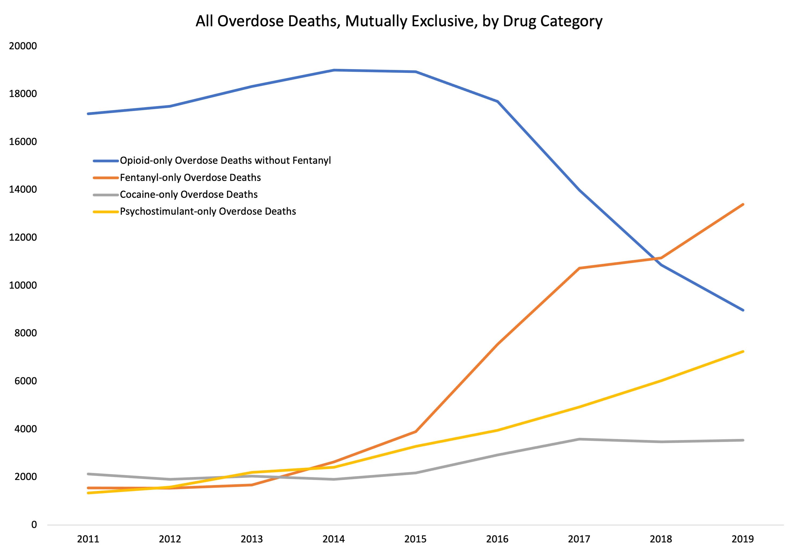
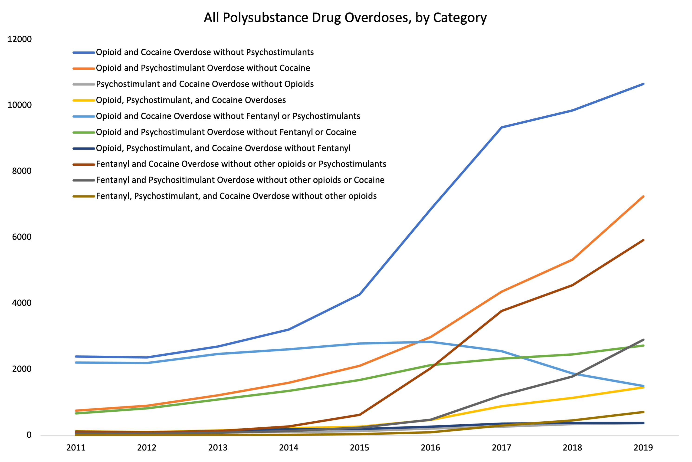

# Analyzing overdose death data, 2011-2019
Data sources: [CDC/NCHS](https://www.cdc.gov/nchs/data_access/vitalstatsonline.htm); [NBER](https://www.nber.org/research/data/mortality-data-vital-statistics-nchs-multiple-cause-death-data)

CDC/NCHS has the original multiple mortality cause-of-death data in .DUSMCPUB (flatfile) format, which can be parsed using the code in *NCHS_Code/VSYearMORT_Parser.py*, but the 2018 data is inconsistent (in .txt fixed width file format instead). Because of this, I recommend downloading the data in .csv format from NBER.

### Analysis reproduction steps:
1. Place data files in a subdirectory (I called mine "Data_NBER") 
2. Run 'import data.rmd' to filter all overdose (OD) deaths and combine into one dataset (~500,000 records)
3. Run 'analyze ODs.rmd' to generate OD counts by drug category (all opioids, opioids without fentanyl, fentanyl, cocaine, psychostimulants, alcohol)
4. Summary file generated will contain number of OD deaths for each drug category for each year

## Results

